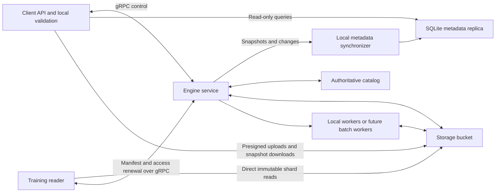

# Client and engine architecture: implementation and continuous validation

Status: implementation plan, written October 6, 2026. The architecture described
below is a target, not a description of functionality already implemented.

This document is sufficient context for an implementation session. Implement the
Python client/server separation, metadata replication, direct bucket uploads, and
direct training reads in the phases below. Rust execution and cloud batch
scheduling are subsequent work; establish their contracts now without claiming
they have been implemented. Keep this document updated with completed phases,
verified commands, material decisions, and remaining limitations.

## 1. Requirements and decisions

PremixDB must distinguish a researcher-facing client from an engine that processes
corpora and owns authoritative storage. The client runs on the researcher's
computer. It understands every query it submits but does not execute corpus
processing, enrichment, selection, tokenization, sampling, or packing.

The agreed requirements are:

1. All client-to-engine communication uses gRPC, including local demo execution.
   There is no embedded coordinator, Python function-call fallback, shared engine
   database, or access to the engine's private filesystem.
2. Bulk data travels directly between clients/readers and a storage bucket.
   Presigned HTTP uploads and direct S3 reads are explicitly permitted. Thus,
   "gRPC only" describes communication with the engine, not communication with
   storage. Do not proxy corpus uploads or training shards through engine RPCs.
3. The client's SQLite database is a read-only, eventually consistent metadata
   replica. Download a complete authorized metadata snapshot initially, then keep
   it current asynchronously. The public API never writes catalog metadata.
4. The client performs complete semantic validation locally using the same rules
   as the engine and pinned metadata. Unknown prerequisites must not masquerade
   as successful validation.
5. The engine performs all meaningful data computation, manages immutable
   artifacts and authoritative metadata, and owns scheduling and publication.
6. The initial engine is a separate local Python process. The same protocol must
   accommodate a remote Rust implementation without changing client workflows.
7. Keep one Python distribution named `premixdb`, with internal module boundaries
   and optional dependency extras. Separate wheels are not required.
8. Training readers should read already packed datasets directly from S3 using
   presigned downloads or scoped read-only credentials. Local verified caching is
   optional. Tensor assembly does not move tokenization or packing into the client.
9. Preserve the useful fluent API, lazy construction where compatible with full
   validation, typed train/validation/test views, reproducibility, and provenance.
   Before v1, change APIs when necessary for this architecture rather than adding
   a second embedded implementation for compatibility.



The metadata arrows above represent gRPC control/change delivery and direct
download of a published snapshot; they do not imply access to the server's SQLite
file. Workers can use engine-owned storage and internal execution protocols.

### Scope of local work

Allowed local work is bounded by the request, catalog metadata, or I/O buffers:
typed construction, validation, canonicalization, hashing, statistical summation,
estimates, token-budget allocation arithmetic, browsing metadata, transport,
integrity verification, packed-data decoding, and tensor assembly.

Disallowed client work includes reading corpus documents to validate a query,
running model inference, filtering analytical columns or bitmaps, enumerating
selected populations, building indexes, producing token encodings, generating
large RegMix proposal populations, assigning content splits, and packing data.
Parsing uploaded JSONL/gzip, resolving Hub revisions, and decoding text previews
belong to the engine. The upload path streams existing files without preparing
corpus data. Small existing in-memory `Source` values may be serialized and
uploaded, but they must not bypass the storage upload protocol.

Statistics derived locally must remain honest: missing values are unknown, not
zero; estimates are not exact counts; overlapping snapshot populations cannot be
summed as if disjoint. Exact profiles for arbitrary predicates remain engine work.

## 2. Starting point in the checkout

The source pointers below were inspected when this plan was written. Reinspect
them before editing: work may have continued in another session.

| Current source | Existing coupling or behavior | Target |
| --- | --- | --- |
| [`api/database.py`](../src/premixdb/api/database.py) | Constructs `Coordinator`, `Catalog`, `ObjectStore`, and `RangeReader`; exposes storage/worker options | Client session, gRPC channel, replica and reader configuration |
| [`api/base.py`](../src/premixdb/api/base.py) | Admission and waiting use coordinator internals and local futures | Durable operation handles and gRPC observation |
| [`api/snapshot.py`](../src/premixdb/api/snapshot.py), [`api/query.py`](../src/premixdb/api/query.py) | Call `_plan_query`, import planner/runtime, read lineage | Pure draft construction, local validation, explicit engine RPCs |
| [`api/mixture.py`](../src/premixdb/api/mixture.py), [`api/dataset.py`](../src/premixdb/api/dataset.py) | Resolve mixtures and compute profiles through private coordinator methods | Prepared evidence and remote operation/result handles |
| [`api/collections.py`](../src/premixdb/api/collections.py) | Reads storage membership and catalog internals | Read-only replica indexes and public metadata types |
| [`api/curation.py`](../src/premixdb/api/curation.py) | Token sampling construction can load the default tokenizer | Typed tokenizer references without loading assets |
| [`engine/sources.py`](../src/premixdb/engine/sources.py) | Public source types also read/parse files and resolve Hub revisions | Neutral source specs; upload transport in client; parsing/resolution in engine |
| [`runtime/planner.py`](../src/premixdb/runtime/planner.py) | Validation, dependency pins, engine steps, identity and local code revision resolution are intertwined | Pure contract planner plus engine physical lowering |
| [`runtime/catalog.py`](../src/premixdb/runtime/catalog.py) | Producer recipes and selector validation reach into runtime/enrichment | Declarative field/asset capabilities and pure semantic checks |
| [`runtime/mixing.py`](../src/premixdb/runtime/mixing.py), [`runtime/datasets.py`](../src/premixdb/runtime/datasets.py) | Pure arithmetic is mixed with population access, tokenization, capacity checks and candidate generation | Pure contract checks; exact evidence and candidate generation in engine |
| [`runtime/coordinator.py`](../src/premixdb/runtime/coordinator.py) | Session, dispatch, execution, storage and publication | Engine application service behind gRPC adapters |
| [`storage/metadata.py`](../src/premixdb/storage/metadata.py) | SQLite metadata, local cache invalidation, indexes, backup | Authoritative transactional catalog plus durable replication journal |
| [`storage/ranges.py`](../src/premixdb/storage/ranges.py), [`training/sequences.py`](../src/premixdb/training/sequences.py) | Verified range reads currently use local file URIs | Neutral packed-data contracts and direct bucket readers |
| [`runtime/partitions.py`](../src/premixdb/runtime/partitions.py), [`runtime/pipeline.py`](../src/premixdb/runtime/pipeline.py) | Local partition tasks, receipts, map work and reconciliation | Engine-private execution with extensible artifact/partition contracts |
| [`runtime/environment.py`](../src/premixdb/runtime/environment.py) | Installed Python source/environment contribute to execution identities | Engine-owned provenance, independent of researcher environment |

Public protobuf messages exist under `proto/premixdb/v1`; private derivation,
analytics and worker messages exist under `proto/premixdb/internal`. They are not
yet gRPC services. Public messages also contain local storage references; do not
expose an internal persistence payload as a remote response merely because it is
already protobuf.

The current build generates `_pb2.py` and `_pb2.pyi`, not service bindings.
[`src/_premixdb_build.py`](../src/_premixdb_build.py) and
[`scripts/generate_protos.py`](../scripts/generate_protos.py) must generate,
enumerate, package, remove obsolete, and verify `_pb2_grpc.py` outputs too. Otherwise
the existing obsolete-file cleanup can remove newly generated service modules.
Generated files remain ignored build outputs; edit schemas and generators.

The existing architecture tests check lower-layer independence from API/runtime.
They do not enforce the new client boundary. `pyproject.toml` currently installs
heavy processing dependencies into the base distribution. `Makefile` already
provides explicit lint, type, protobuf, test, integration, coverage and build
checks. No `.github/workflows` directory was present at inspection; add a CI
workflow or integrate these gates into the repository's actual CI if that changes.

The checkout had unrelated uncommitted documentation and implementation changes
when this plan was created. Inspect `git status` and relevant diffs. Preserve
unrelated work; do not reset the tree or assume every existing diff belongs to
this migration. Do not introduce commit/push hooks.

## 3. Module boundaries and installation

Use this target organization, adapting filenames as necessary without weakening
the dependency rules:

```text
src/premixdb/
  __init__.py                 # Lightweight public exports
  client/
    api/                      # Fluent handles and public session
    transport.py              # Typed gRPC facade and errors
    metadata/                 # Read-only views and private replication writer
    uploads.py                # Presigned HTTP transfer only
  contract/
    requests.py               # Typed specifications and defaults
    validation.py             # Pure semantic checks
    planning.py               # Canonical logical plan and prerequisites
    identity.py               # Versioned logical encoding and digests
    capabilities.py           # Typed field/asset/operation definitions
  engine/
    server.py                 # gRPC adapter, auth and process lifecycle
    service.py                # Application operations and admission
    runtime/                  # Planning, scheduling, materialization
    algorithms/               # Current engine kernels
    storage/                  # Authoritative catalog and bucket publication
    enrichment/               # Model/provider implementations
  training/
    manifest.py               # Read-only published dataset manifests
    reader.py                 # Direct reads, sharding and checkpoints
    objects.py                # HTTP/S3 transport and verified cache
    torch.py                  # Optional tensor adapter
  cli/                        # Thin client commands; explicit engine launcher
  fields/                     # Neutral typed field vocabulary/re-exports
  schemas/                    # Neutral adapters/codecs, or moved into contract
  rpc/v1/                     # Generated service/messages
  v1/                         # Existing durable messages as needed
  internal/                   # Existing engine-private messages
proto/premixdb/rpc/v1/
```

Move code by responsibility, not just by directory. Small public records such as
`Source`, `Tokens`, `Bounds`, `RegMix` policy parameters, source specifications,
checkpoint types and field selectors must not require an engine import. Move or
split the current `contracts.py` accordingly. Preserve top-level public exports
where useful; private module paths do not require compatibility shims.

Import rules:

| Layer | May depend on | Must not depend on |
| --- | --- | --- |
| Contract and fields | Standard library, lightweight codecs, protobuf messages | Client, engine, training, cloud SDKs, inference libraries |
| Client/API/replica | Contract, fields, public generated RPC/messages, lightweight HTTP | Engine modules, private persistence messages, model/data-processing libraries |
| Training | Contract, published manifest codecs, direct-storage transport; optional torch | Engine/runtime, model tokenizers, private engine catalog or publication code |
| Engine | Contract, public services, engine kernels/storage/providers | Client implementation and client replica writer |
| CLI | Client for client commands; lazy engine import only for `engine serve` | Eager engine loading in ordinary commands |

Share a genuinely neutral verified-byte codec where useful, but never make
training depend on the engine's storage package. Raw `ObjectRef`/`SpanRef` values
need a portable interpretation and a client-visible codec; server-private paths
must not reach a reader.

Keep a single wheel containing the Python modules. The base installation includes
the lightweight gRPC/protobuf/HTTP/integrity dependencies necessary for the client
and presigned reader. Move compute dependencies into `[engine]`; keep `[torch]`
for tensor adapters and, if needed, `[s3]` for the AWS SDK credential-based reader.
The engine extra must include its own required processing dependencies, including
platform-specific constraints already needed on Intel macOS. Extras control
installation, not runtime architecture.

```bash
pip install premixdb
pip install 'premixdb[engine]'
pip install 'premixdb[torch,s3]'
```

Installing the engine extra must not cause `import premixdb` to load it. Client
and engine processes can use different versions/environments if they negotiate
a compatible protocol and contract. Later Rust service deployment is independent
of how the Python SDK is packaged.

## 4. The local validation guarantee

### 4.1 Define what is guaranteed

A request marked **ready** by the client, bound to a supported semantic contract
and pinned immutable prerequisites, must not subsequently fail execution because
the request has an invalid type, unsupported operator, incompatible projection,
bad policy combination, unknown domain, infeasible allocation, or invalid asset
definition. The engine independently repeats admission validation before scheduling.

This is not a promise that networks, storage, permissions, model downloads,
hardware, or engine implementations never fail. Classify those separately. Stale
authorization or an expired capability/preparation context can prevent admission;
they must not be reported as query syntax errors after work has started.

The guarantee has two boundaries: local validation establishes semantic readiness
for its pinned context; atomic server admission establishes that the context is
still acceptable and retains the required references. Once accepted, semantic
query errors indicate a validator/executor defect and must fail conformance tests.

### 4.2 Separate rules from physical execution

Implement a pure API with equivalents of:

```text
normalize(spec, contract) -> canonical_spec
validate(canonical_spec, metadata_view, evidence) -> validation_result
logical_plan(canonical_spec, context) -> plan + prerequisite_requirements
```

Use concrete typed result variants:

- `Invalid`: stable diagnostic code, request field path and readable explanation.
- `NeedsMetadata`: exact references or minimum replica watermark required.
- `NeedsPreparation`: exact data-dependent prerequisites required.
- `Ready`: canonical request, logical digest, contract/capability identifiers and
  immutable evidence references.

`NeedsMetadata` and `NeedsPreparation` are not successful validation. Drafts may
be saved locally outside the catalog replica, but cannot be submitted as ready.
Expose a typed validation/plan inspection method on drafts. Ordinary fluent use
may fetch metadata or initiate preparation automatically when execution is
explicitly requested, with visible progress; it must not compute locally.

Do not place an engine RPC inside the pure validator or make local validation a
wrapper around a remote `Validate` call. The client understands all rules.

### 4.3 Inventory every rule, including late failures

Create a rule inventory linking each rule to its current owning source, required
facts, shared implementation and tests. Cover at least:

- Required fields, ID widths, enum values, optional presence, unknown fields,
  finite numeric values, integer overflow and resource limits.
- Intrinsic/enriched field types, comparison operands, null semantics, classifier
  label vocabulary, scalar/probability/top-class projections and vector bounds.
- Ordered operations, dedupe policies, ordering/ties, decontamination references,
  document/span granularity, and sampling budget/tokenizer combinations.
- Tokenizer/model definitions, immutable asset digests, vocabulary/special-token
  bounds, maximum document handling and padding/separator policy.
- Domain definitions, exact assignment coverage, weights, deterministic integer
  allocation, capacity, replacement, epoch caps and mixture bounds.
- Split fractions/seeds, membership before sampling, fixed validation/test
  populations across candidates, empty populations and zero-output packing.
- Candidate count and proposal limits, concrete generated candidates, serialized
  control-record limits, and explicit outcome when constraints are infeasible.
- Availability and compatibility of pinned prerequisites, not just ID shape.

Keep Python client and Python engine on the same rule functions. Defaults must
normalize once under the selected contract, not independently on each machine.
Provider output validation belongs at engine artifact publication: malformed
fields become provider/artifact errors rather than late predicate errors.

### 4.4 Exact evidence for data-dependent rules

Ordinary predicate validity requires field metadata, not scanning documents. Exact
mixture feasibility can require the actual selected population, token inventory
under the requested tokenizer, content transformations and split policy. An
assignment map can require coverage evidence. Marginal histograms and estimates
cannot prove those facts.

The engine therefore prepares exact immutable evidence only when required. Bind
each evidence record to its logical query digest, snapshot union, domain policy,
tokenizer digest, transformations, split policy, contract version and artifact
identity. Include exact counts/capacities and completeness facts needed by local
rules. For a large assignment set, the engine can publish a coverage receipt
bound to the uploaded assignment manifest digest; do not replicate every document
ID into SQLite solely to repeat a set comparison locally.

RegMix proposal generation remains engine computation. Prepare and freeze the
concrete candidate recipes, then locally check each recipe against the exact
inventory and bounds. Checking arithmetic over returned candidates is allowed;
repeating a million-proposal search on the laptop is not.

Accept engine-issued evidence only from the authenticated service and verified
artifacts, and only when its complete binding matches the request. An evidence
receipt certifies the corpus fact; local code evaluates the policy against it.
It must not be an opaque assertion that an arbitrary query is "valid."

Preparation is an engine operation and may itself discover infeasibility. Return
the facts/structured diagnostic so the client can reject the final request before
execution admission. This can require first-use computation before final
submission, reducing laziness for those operations. Do not claim unconditional
validity from approximate metadata to avoid that cost.

### 4.5 Admission, identity and implementation parity

Submit the canonical request, selected contract, evidence references, context
identifier and idempotency key. In one authoritative transaction the engine:

1. Authenticates and checks the context and prerequisite bindings.
2. Runs the same semantic validator and verifies the logical digest.
3. Resolves references and retains them for accepted work.
4. Saves the operation/request mapping and publication journal events.
5. Makes accepted work eligible for scheduling only after commit.

Publish explicit contract versions; an upgrade must not silently reinterpret an
accepted request. Retain the accepted implementation/assets or reject a context
before admission. A capability context can have an advertised lease; the client
renews an expired context before calling a request ready. It is not necessary to
require the entire replica to be at the latest global revision for every query.

Separate logical recipe identity from execution provenance. Logical identity
includes semantic version, canonical ordered operations, normalized sets/maps,
seeds, snapshot/asset pins, split and sampling policies. It excludes endpoints,
credentials, expiring URLs, object relocation, worker count, retries and the
researcher's installed Python environment. Engine implementation/environment
fingerprints belong in execution/provenance and artifact compatibility records.

Define a versioned canonical encoding with exact integer/float rules, presence,
map ordering, set normalization and Unicode handling. Adapt the useful existing
`runtime/mixing.py` encoding; audit identity code that hashes transport bytes.
Deterministic protobuf serialization is not a cross-language canonical encoding.
Do not merge outputs from different engines just because logical recipes match:
artifact reuse also requires an explicitly compatible semantics/implementation
and verified content. Version new identity domains; never relabel existing IDs.

Before introducing Rust kernels, implement a small Rust contract crate and use
it through Python bindings so both sides can execute the same validator. Until
then, language-neutral golden vectors and a common conformance suite are required.
Cross-language execution parity must specify exact versus tolerance-based results,
especially numeric profiles and model outputs, rather than assuming byte equality.

## 5. Read-only, eventually consistent SQLite replication

"Read-only" means all application/query connections open `mode=ro`. A private
synchronizer is the sole writer, and only applies server-authored replication.
No API resource save, local catalog registration, estimates written by a query,
or training cache entry can write the replica. Store drafts, downloaded data,
shell history and other local state separately.

### 5.1 Server publication and initial download

Maintain a durable metadata journal transactionally with every authoritative
client-visible mutation. The current connection-local revision and SQLite
`data_version` are cache invalidation tools, not remote replication cursors.

Define a cursor with catalog epoch, projection/schema version, authorization
scope and monotonic commit position. An epoch changes on incompatible restore or
catalog replacement. Never allow a cursor from one server/scope to replay into
another cache. Global sequence gaps caused by filtering need explicit cursor
advancement semantics; do not mistake them for missing transactions.

`OpenCatalog` returns an authorized SQLite export at position `N`, schema version,
size/checksum, download authorization, and a replay token for changes after `N`.
The exported snapshot and cursor must represent the same transaction-consistent
catalog state. Use SQLite's backup/snapshot facilities; do not copy an actively
changing database file and forget its WAL. The export is a client projection,
not a dump of private engine tables, credentials, worker receipts or other users.

Publish the complete export as an immutable bucket object and download it using a
presigned URL. Keep history or a replay lease long enough to bridge download and
subscription. Otherwise return a fresh snapshot rather than losing intermediate
changes. Verify the complete downloaded snapshot before installing it.

Download to a temporary path. Validate scope, epoch, schema, checksum and SQLite
integrity. Atomically install the cache and begin `WatchCatalog(after=N)`. On a
failed first download do not expose a partial catalog; on a failed replacement
keep serving the previous valid cache as stale.

### 5.2 Incremental updates and concurrency

Use typed logical transaction batches, not raw server WAL frames or downloaded
SQL statements. Each batch includes identity/cursor boundaries, typed upserts,
tombstones, and integrity/schema information. Validate message types, resource
digests and size limits before applying. For large transactions, assemble bounded
chunks with a verified completion marker and commit only a complete transaction.

The synchronizer applies records and advances its cursor in the same local SQLite
transaction. Duplicate delivery is idempotent. A crash exposes either the old
commit or the full new commit. A mismatch, reordered batch, unfillable gap or
epoch change causes resynchronization instead of guessing.

Use one elected synchronizer per cache identity/path; other SDK instances open
read-only views. Coordinate ownership with a bounded local lock and recover from
a dead owner. SQLite WAL with properly provisioned sidecars permits concurrent
read-only views; manage checkpoints and close resources. Do not use
`immutable=1` on a database that the synchronizer modifies. A read/validation
operation holds a consistent read transaction; later operations can see new
commits. Replacing a cache requires reopening readers onto the new generation.

Bound change-stream buffers, coalesce updates where transaction semantics permit,
and reconnect with backoff. Idle sessions must not poll continuously or consume
unbounded history in memory. A stopped client leaves a reusable valid cache and
cursor. Credential expiration triggers renewal, not cache corruption.

### 5.3 Freshness in the public API

Expose cache revision/epoch, last successful synchronization, connected/stale
state, and an explicit `sync()`/minimum-watermark barrier. Normal listing and
profile inspection are local and may be stale. Offline cached reads work; offline
submission cannot establish engine admission.

Metadata absence can mean replication lag rather than server nonexistence. When
required, fetch/catch up through gRPC and retry local validation. Mutable corpus
names resolve to explicit immutable snapshots; execution never follows a moving
"latest" pointer. Retain immutables/evidence for accepted operations so lagging
metadata cannot change what a request means.

RPC results may return detached in-memory handles/profiles immediately, including
a publication watermark. They do not write SQLite directly. Operation waiting
can use `WatchOperation` while the replica catches up. If a caller immediately
lists a newly created resource, either accept documented eventual consistency or
call the explicit watermark barrier; avoid hidden full-catalog refreshes.

Scope caches by server/catalog identity and authorization projection. Changing
credentials/scopes must not expose a previous principal's cached records. Do not
promise deletion of data already downloaded by a formerly authorized user;
enforce current access on new engine/storage requests and handle cached metadata
according to the chosen local-cache policy.

## 6. gRPC services and operation lifecycle

Define services under a new versioned RPC namespace. Reuse neutral existing
messages where their semantics fit; add wrappers/projections where they do not.
Do not renumber persisted fields or expose engine-private messages for convenience.

| Service area | Operations and behavior |
| --- | --- |
| Session | Handshake: protocol/contract versions, catalog identity, capability definitions, limits and context renewal |
| Catalog | Open authorized snapshot, watch/resume changes, fetch necessary metadata and explicit sync barriers |
| Sources/assets | Begin upload, authorize multipart parts, complete/abort upload; resolve Hub source/asset descriptors in engine |
| Planning | Prepare prerequisite evidence; return typed pinned plans/evidence; inspect readiness without physical lowering in client |
| Execution | Idempotent submit, get/watch operation, explicit cancel, retry policy and history |
| Inspection | Bounded document/sequence previews, profiles, provenance and resource lookup |
| Dataset access | Publish/fetch immutable manifests and grant/renew direct-storage access |

Use explicit typed methods/oneofs for query, capture, mixture and dataset work,
not a generic arbitrary Python-call RPC. Shape method names during implementation,
but preserve these responsibilities. `Get`/`List` must not silently schedule new
compute. Execution or prerequisite preparation is explicit even when a fluent
method initiates it for the caller.

Give each accepted operation a durable ID separate from resource identity and
request idempotency. Persist the canonical request digest, actor/scope, status,
timestamps, result IDs, diagnostic and publication watermark. Reusing the same
idempotency key with a different request must fail before scheduling; retrying the
same accepted request after a lost response returns the same operation.

States should distinguish accepted/queued, running, successful, failed and
cancelled. Keep preparation readiness separate from execution status. Publish a
resource as completed only after its immutable artifacts are verified and durable.
Journal resource and operation transitions atomically with catalog mutations.
Engine restart must reconcile accepted/running work and partial publication
without duplicating committed output. It is acceptable initially to restart a
deterministic task; abandoned operations must not remain running indefinitely.

Client `wait(timeout=...)` observes an operation with a bounded deadline; a timeout
does not cancel work. `close()` stops local synchronization and closes connections;
it does not wait for or shut down the engine's jobs. Cancellation is an explicit
engine operation. Decide and test how cancellation interacts with a concurrent
successful publication; do not mark a completed output corrupt or unpublished.

Map gRPC transport status and typed diagnostics into distinct Python exceptions:
semantic invalidity, missing prerequisites, stale context, permissions, transport
unavailability/deadline, resource exhaustion, storage/integrity failure, and engine
defect. Include stable rule codes and field paths; do not use string matching to
classify errors. After admission, query-semantic failures are contract defects.

Use TLS/authentication for remote services, explicit loopback development mode,
bounded request/response sizes, backpressure, retry policies and redacted logs.
Signed URLs, credentials and bearer tokens never enter durable recipe identities
or logs. Automatic retries are limited to operations with safe/idempotent semantics.

## 7. Direct bucket ingestion and engine storage

### 7.1 Upload protocol

1. The client describes the input kind, byte size if known, and format/options via
   `BeginUpload`. This is a transport/source specification, not local parsing.
2. The engine returns an upload ID, staging object target, required headers,
   expiration, and presigned PUT or multipart part URLs.
3. The client streams raw bytes to the bucket with bounded memory. For multipart,
   renew authorization and retry individual parts without restarting all data.
4. The client calls `CompleteUpload` with the upload ID and part receipts.
5. The engine completes/verifies the object, checks sizes/checksums, and creates a
   retained immutable source/asset reference. Capture references that input ID.
6. Parsing, decompression, capture limits, duplicate-key policy, Hub retrieval and
   preprocessing run in engine operations.

Completion must be idempotent. An incomplete upload is never queryable. Support
abort and cleanup of expired multipart/staging data. Use randomized staging keys;
a reusable upload URL must not overwrite a published immutable input. Publish a
separate retained object/version, or enforce an equivalently strong immutable
promotion protocol. Pin bucket versions when relevant and verify content.

S3 ETags are not a universal content digest. Keep the existing BLAKE3 identity and
verification contract, distinguishing it from bucket-supported upload checksums.
Do not claim the bucket verifies BLAKE3 just because the client sent a header;
engine verification may require streaming the upload. This is engine computation.
Handle a changed local file during upload as an input transfer failure, not a
silently altered immutable source.

Local `source="path"` can remain a convenience, but now means "upload this file"
and never sends a laptop pathname for the server to open. Directories become a
bounded upload manifest with stable logical keys. Existing memory-source builders
must upload serialized inputs rather than embed unbounded text in gRPC messages.
Tokenizer/model assets follow the same immutable upload/register workflow; small
public policy constructors no longer load GPT-2 or fetch Hugging Face metadata.

### 7.2 Storage adapter and local demo

The engine needs a bucket adapter for input/output publication, verification and
manifest access, in addition to its local scratch space and authoritative SQLite.
Existing local-only artifact URIs, publication helpers and partition stores need
an adapter boundary; a server process wrapped around local paths is insufficient
for the target remote workflow.

Configure bucket, region, endpoint and engine credentials on the engine process.
Support an S3-compatible endpoint for a reproducible local demo/integration harness.
Presigned URLs must be reachable from the client, not just the server's internal
network namespace. The Python engine may use local scratch for algorithms but
publishes reader-facing artifacts to configured storage. Do not silently fall
back to embedded compute or shared files when bucket configuration is missing.

Start the engine explicitly. A future convenience launcher may spawn it, but cannot
import it into the client process or change the communication path. A local demo
without bucket infrastructure is not the complete target and must be labelled
accordingly rather than weakening upload/reader invariants.

## 8. Direct training reads

The engine publishes a portable immutable dataset manifest. It contains the
logical dataset/split identity, contract and codec versions, tokenizer definition,
sequence counts/order, shard locations and versions, byte/page indexes, token and
mask formats, integrity digests, and provenance references needed by readers.
Large per-sequence metadata belongs in immutable index artifacts, not replicated
SQLite rows or a huge inline control response. Storage relocation does not change
logical dataset identity, but readers must verify the resolved artifact identity.

Separate stable object locators from expiring access grants. A manifest contains
no credentials or presigned URLs. An access provider obtains URLs/credentials via
gRPC or uses the training machine's scoped IAM role. Choose access modes:

| Reader environment | Mechanism |
| --- | --- |
| Laptop without AWS permissions | Batched presigned GET grants, renewed as required |
| Training machines near storage | Read-only workload IAM role or scoped temporary credentials |
| Offline reuse | Previously downloaded, verified immutable data cache |

Grant read access to retained dataset objects/prefixes, not arbitrary bucket writes.
Avoid an engine call per sequence. Batch grants or use credentials for a manifest
working set; renew before expiration and handle expiration between retries. A
reader with a complete manifest and valid access should continue while the engine
is unavailable, until renewal is required.

Preserve the existing checkpoint, ordinal permutation, rank/worker sharding,
dataset split and mask semantics. Use shard/block prefetch, bounded concurrency,
range coalescing and pooled connections. Benchmark block/shard sizing rather than
fixing an arbitrary optimal S3 request size. A compressed format must have
independently decodable indexed blocks; HTTP byte ranges alone do not make a
whole-file compressed stream randomly readable.

Verify the exact bytes covered by each supplied digest. A partial range cannot be
verified using only a whole-object checksum: provide block/range integrity or
download and verify the whole shard. Local cache keys use immutable identity,
not an expiring URL. Atomic cache publication prevents interrupted downloads from
appearing complete; concurrent loaders reuse verified blocks where practical.
Tensor construction and necessary decoding are bounded reader work; previews that
need model-token text decoding are produced by the engine.

Reader objects must work across PyTorch fork/spawn workers without carrying live
gRPC channels, thread pools, SQLite connections or unrefreshable access tokens.
Recreate transports/access providers lazily in each process. Do not depend on the
researcher's SQLite cache to contain all sequence pages or current credentials.

## 9. API and persisted-state migration

Keep familiar resource handles, but distinguish unsubmitted drafts from saved
remote resources. Construction should not imply materialization. Handle methods
can inspect validation and initiate preparation/execution explicitly. Completed
resources, profiles and previews remain reusable. Exact public spellings can be
chosen during implementation; document them once and test the examples.

Proposed usage, illustrating ownership rather than an already implemented API:

```python
import premixdb as p

with p.PremixDB(endpoint="localhost:50051", cache=".premixdb-client") as db:
    snapshot = db.Corpus("training", source="documents.jsonl")
    query = snapshot.query()
    datasets = query.mix(tokens=10_000, sequence_length=128)
    train = datasets[0].train.torch()
```

The file upload is direct to the bucket; capture, query execution, prerequisite
inventory and packing run in the engine; the reader fetches packed blocks directly.
Only a full `Dataset` exposes `.train/.validation/.test`; an already selected
split uses `.torch()` directly. Preserve content-hash split membership before
sampling and validation/test populations shared across mixture candidates.

Client constructor options are endpoint, authentication, metadata/data cache,
timeouts and progress. Engine storage roots, worker counts, process workers,
model device and compute cache limits move to server configuration. Do not keep
`storage=...` as an alternative embedded session. Offline mode means replica and
verified artifact reads, not a writable engine catalog opened locally. The
always-read-only replica is independent of whether the authenticated user may
submit remote work; do not conflate those permissions.

CLI client commands use endpoint/cache configuration; `premixdb engine serve`
loads the engine explicitly. Update shell history and completion paths to avoid
engine storage ownership. `make shell` and examples must connect to a started demo
service or explain how to start one.

Existing durable messages and completed stores should be read by the engine where
practical. Keep old IDs, schemas and verified artifacts identifiable as legacy.
Provide an explicit engine-side import/migration for local stores and publish
bucket artifacts/portable manifests before making them remotely readable. Never
turn an old writable engine database directly into the client cache or expose
legacy `file://` locators on a remote reader. Re-execution compatibility and
completed-output readability are separate promises.

## 10. Implementation phases and exit criteria

Work in reviewable increments. A phase is complete only when its exit criteria
are verified. Temporary adapters inside the engine are acceptable; a bypass in
the client is not a finished architecture. Record concrete results in section 14.

### Phase 0: baseline and rule inventory

- Inspect current instructions, status and relevant diffs; preserve concurrent work.
- Establish existing test/build results with `make check` once, recording unrelated
  failures/environment limitations rather than assuming a clean baseline.
- Inventory cross-boundary imports, private calls, direct storage I/O, dependencies,
  public examples, identity calculations and every late semantic failure.
- Define the validation rule table, supported operation matrix, readiness states,
  metadata projection, immutable evidence and identity versioning decisions.

Exit: each supported feature has an owner and validation/evidence path; no current
public workflow is omitted merely because it accesses a private method today.

### Phase 1: pure contract and dependency separation

- Extract neutral public types, request normalization, rule evaluation and logical
  plan/prerequisite construction; separate producer metadata from implementations.
- Move local environment resolution and physical lowering into engine code.
- Introduce structured diagnostics and canonical identity vectors.
- Split base/engine/torch/S3 dependencies and lazy package exports.
- Strengthen static import and fresh-interpreter boundary tests immediately.

Exit: the minimal installed client can construct and validate representative
requests without engine imports, heavy libraries, source access or network calls
from pure validation. Python engine and client use identical semantic functions.

### Phase 2: service protocol and standalone Python engine

- Add versioned services/messages, service generation and packaging checks.
- Add explicit server startup, handshake, capability contexts and typed transport.
- Wrap existing application operations while removing client access to coordinator
  internals; keep physical implementation adapters behind the engine service.
- Implement durable admission/idempotency, operation observation, timeouts,
  cancellation and restart reconciliation.

Exit: a separate-process client/server test captures and executes a tiny workflow
through actual gRPC, with no direct client engine import or function-call fake.
Data upload/publication may be transitional until phase 4; do not claim full
bucket compliance yet. Retry after lost submit response reuses accepted work.

### Phase 3: bulk bootstrap and asynchronous metadata replication

- Introduce transactional authoritative journaling, scoped projection and export.
- Implement snapshot descriptor/download, checksummed install and cursor replay.
- Implement one private synchronizer, read-only API views, reconnect/resnapshot,
  watermark barriers, concurrency and stale/offline reporting.
- Move listings and saved profiles to local views; keep direct RPC response values
  detached instead of writing them into the replica.

Exit: a client starting from an empty cache reaches the exact projected catalog;
after disconnect/restart it converges to the same state including deletions.
Concurrent validation never sees a partially applied metadata transaction.

### Phase 4: bucket storage and presigned ingestion

- Add engine bucket publication adapter and configurable S3-compatible endpoint.
- Add staging, multipart authorization/completion, immutable verification and abort.
- Switch file/directory/memory source and custom asset ingestion to direct storage.
- Move Hub resolution, input parsing and tokenizer loading into engine operations.
- Publish initial metadata exports through bucket storage as specified in phase 3.

Exit: uploads succeed with no client AWS write credentials and no corpus bytes or
laptop paths sent for engine-local reads over gRPC. Reusable staging URLs cannot
change a published input. A real compatible storage endpoint verifies the protocol.

### Phase 5: complete preparation and semantic admission

- Apply the rule inventory to every exposed query/mix/dataset feature.
- Implement exact inventory/coverage evidence and frozen candidate recipes.
- Bind evidence and contracts to canonical requests; enforce readiness locally
  and repeat validation atomically before engine scheduling.
- Ensure capability freshness and retained inputs across lag, upgrade and restart.
- Audit executors for remaining user-request errors after admission.

Exit: all advertised operations satisfy the readiness/admission guarantee. Every
semantic rule has a boundary test. Statically invalid requests schedule zero
compute; requests missing exact evidence may schedule prerequisite preparation,
but cannot schedule final execution. Ready requests with exact evidence do not
encounter later query-semantic errors. Any unsupported feature is explicit and
blocked locally, not silently approximated.

### Phase 6: portable manifests and direct training reader

- Publish indexed manifests, tokens, masks and provenance to the bucket.
- Implement presigned and credential-based readers, grant renewal, verified cache,
  prefetch/coalescing, multiprocessing and resumable checkpoints.
- Switch sequence/torch access away from local engine range readers.
- Verify fixed split populations and existing packing/token-budget accounting.

Exit: installed client/torch packages read a completed dataset with no engine
compute imports. With a pinned manifest and valid access, iteration continues
while the engine is stopped. Rank/worker coverage, checkpoints, masks and integrity
match the reference behavior, including after reconnect and process spawn.

### Phase 7: consolidate, migrate and document

- Move remaining execution modules under engine ownership and remove dead embedded
  paths, direct catalog access, old CLI ownership and unused dependencies.
- Implement/test the explicit legacy-store migration and identity version handling.
- Update README, architecture/persistence/training/development/serialization docs,
  shell workflows, numbered tutorials and recipes to actual service behavior.
- Ensure the source distribution and installed wheel include services and support
  the base-only client, engine extra and reader extras independently.

Exit: the complete supported workflow satisfies all requirements in section 1;
`make check`, installed-environment gates and service/storage integration gates
pass. Report actual live-storage/model verification separately from fixtures.

### Phase 8: continuous gates and performance baselines

- Add the CI matrix and regression suites below using portable local commands.
- Establish reproducible metadata/bootstrap/validation/reader/admission benchmarks
  with bounded synthetic corpora; save environment and measured results.
- Turn demonstrated architectural and resource bounds into ongoing checks.

Exit: subsequent changes cannot quietly reintroduce client compute, semantic
drift, unrecoverable replication, proxy data reads or heavy base dependencies.

## 11. Continuous correctness validation

Use fast bounded fixtures by default, usually one or two documents. Add only the
smallest extra population needed for a boundary. Maintain independent expected
results or `tests/_reference.py`; comparing two wrappers of the same implementation
does not independently establish executor correctness.

### Required regression matrix

| Area | Cases | Assertion |
| --- | --- | --- |
| Imports | Base wheel, extras installed, CLI, contract, field constructors, reader spawn | No forbidden engine/compute imports; lower layers remain independent |
| No client compute | Patch engine entry points to fail, restrict client filesystem, observe transports | Only metadata/request arithmetic and explicit storage I/O occur locally |
| Validation parity | Every rule, malformed protobuf, unknown enums/fields, absent versus zero, int64 above 2^53, NaN/infinity | Same normalized plan and stable diagnostic codes on both sides |
| Semantic readiness | Invalid types, missing facts, infeasible domains, exhausted capacities, incompatible assets | Invalid/needs-preparation requests never enter final execution scheduling; preparation is explicit |
| Exact evidence | Wrong population/tokenizer/split/assignment digest, stale or incomplete receipt | Evidence rejected locally and by admission; valid evidence permits execution |
| Execution semantics | Ordered filters, nulls, dedupe/ties, decontamination, sampling, projections, empty outputs | Public outputs/profiles agree with independent expected results |
| Identity | Map/input permutations, ordered-step changes, optional presence, Unicode, relocation, version bumps | Correct equality/difference; no dependency on SDK environment or expiring access |
| Admission | Lost response, duplicate request, mismatched reused key, dependency removal race | One accepted operation, conflict before compute, retained immutable inputs |
| Operation lifecycle | Engine restart, queue backpressure, deadline, cancellation/publication race, client close | Durable recoverable state; timeout/close never implicitly cancel |
| Bootstrap | Snapshot with concurrent mutations, interrupted download, checksum/schema/scope mismatch | Verified atomic install at N followed by complete replay |
| Replication | Duplicate/partial/reordered delivery, crash between apply and cursor, gaps, restore epoch, tombstones | Exact convergence; no partial transaction or wrong catalog contamination |
| Cache concurrency | Multiple SDKs, dead sync owner, long read transaction, replacement | One writer, stable reads and bounded recovery; API writes fail |
| Uploads | Missing part, retry, expiry, wrong headers/checksum/size, replay after completion | No partial capture; immutable published input cannot be overwritten |
| Source behavior | JSONL/gzip, duplicate keys, limits, memory inputs, mutable Hub revision | Parsing/resolution in engine; stable retained source identity |
| Reader integrity | Partial block, corrupted data/index/mask, stale object version, interrupted cache write | Detect failure; never silently return altered tokens |
| Reader access | Expired URL/credentials, renewal failure, engine outage with valid grants | Safe bounded retry; no renewal RPC per sequence |
| Training semantics | Rank/worker combinations, fork/spawn, checkpoint restore, split views, repeated occurrences | Exact ordinal coverage/order, masks and provenance; no compute imports |
| Legacy formats | Completed old store, moved paths, new identity domain, unavailable old execution pin | Explicit readable/migration behavior; no relabelled or silently recomputed output |
| Packaging | Wheel/sdist/editable, base/engine/torch/S3 extras, service generation | Minimal environment works; generated bindings ship and match schemas |

Extend existing architecture, requests, properties, analytics, profile planning,
materialization, initialization, partitions, packing, sequence, torch and packaging
tests instead of replacing independent coverage with a new monolithic test.
Preserve the useful property tests for allocation, shuffle bijection, ordinal
partition coverage and packing boundaries. Add replication state-machine and
contract normalization properties with shrinking counterexamples.

Tests for local validation must also assert zero network calls and zero corpus
reads inside the pure validator. Integration tests must cross a real process and
gRPC transport. Stub object services are useful for fault injection but do not
replace an actual S3-compatible presigning/multipart integration test. Keep real
cloud smoke tests small, credential-gated and reported distinctly; never silently
count a skipped live test as verified cloud behavior.

### Installed-environment and import gates

Add isolated environments for the built wheel, not only the development checkout:

1. Base installation without engine or torch dependencies: import public API,
   construct/validate queries, bootstrap metadata and upload/read through signed HTTP.
2. Base plus engine: start a separate engine process and run service workflows.
3. Base plus torch/S3: load a packed dataset and spawn reader workers without
   engine dependencies installed.

Inspect declared and installed dependencies. Fresh-interpreter guards must reject
engine modules, private generated messages and heavy libraries during client-only
operations, even when those libraries happen to be installed. Include relative,
dynamic and re-exported imports; static AST checks alone cannot catch all paths.
Check worker subprocesses too. Keep neutral codecs lightweight and testable.

### CI execution

Every change runs lint, types, generated-schema checks, fast semantic/replication
tests, boundary checks and package metadata checks. Changes to protocol,
validation, storage, lifecycle, manifests or readers additionally run the relevant
real-process service and compatible-storage integration suites. Before merging
the completed migration run all non-performance tests and isolated-wheel gates.

Use the existing explicit commands as the baseline:

```bash
make lint
make typecheck
make protos
make test
make integration
make check
```

`make check` currently includes coverage and build; do not run another identical
full suite without new changes/failures. Add focused targets, such as
`test-contract`, `test-replication`, `test-client-install`, and `test-service`, once
their actual tests exist. Wire those commands into CI, not git hooks. The existing
`make sync` uses `--all-extras`, so it cannot prove a lightweight base installation.

Cover the supported Python/OS matrix, including existing Intel macOS constraints
where runners are available. A Linux compatible-storage integration job can cover
network behavior; a separate fork/spawn matrix covers platform-sensitive loaders.
Track unavailable platform/live tests as limitations rather than adding unverified
compatibility claims. Protocol/metadata/manifest versions require compatibility
vectors and an explicit supported-version matrix.

## 12. Continuous performance and production validation

Measure before setting numerical gates. Save fixture size, hardware, dependency
versions, contract/codec version, cold/warm cache state and raw results. Avoid
unstable timing thresholds in fast correctness tests; enforce deterministic
resource bounds there and run calibrated performance comparisons separately.

| Measurement | What to establish |
| --- | --- |
| Local validation | No corpus I/O or inference; time/memory scale with request and relevant metadata, not document population |
| Bootstrap | Export/download/install duration and peak memory at increasing metadata sizes; bounded buffers |
| Incremental sync | Apply throughput, lag under sustained writes, reconnect recovery, WAL growth and batch memory |
| Local browsing | Pagination and saved-profile latency without engine RPCs after bootstrap |
| Admission | Request size, idempotent retry latency, queue bounds, job independence from client lifetime |
| Upload | Multipart throughput, bounded memory, resumability and overhead of engine integrity verification |
| Training | Cold/warm throughput, GPU input starvation, request count/bytes per sequence, prefetch memory, cache hit rate and renewal frequency |
| Engine regression | Existing query-profile and serialization baselines under the service/storage path; distinguish execution from transport overhead |

Reader acceptance includes measured request amortization over blocks/shards, not
merely functional S3 support. Test enough requests to exercise batching; avoid a
one-sequence example concealing one-request-per-sequence behavior. Vary network
latency and worker concurrency before selecting prefetch defaults.

Instrument engine admission rejections by rule code, failures by classification,
operation latency, retry/recovery, publication integrity, metadata export/replay
positions and queue depth. On the client expose replica lag, resnapshot count,
validation readiness/prerequisites, transfer retries and reader cache statistics.
An accepted operation failing with a query-semantic code is an actionable contract
defect. Record sufficient redacted contract/request/asset identities to reproduce
it; never log signed URLs, secrets or raw corpus contents by default.

Continuous production monitoring does not authorize creating an automation in
this implementation session. Add observability and CI; schedule external monitors
only if separately requested.

## 13. Future Rust engine and batch execution

The first implementation is complete when the Python service satisfies this
document. It does not require a Rust rewrite, AWS/GCP Batch deployment or live
model inference on every provider. Preserve these extension points:

- A language-neutral logical plan and canonical identity contract.
- A pure validator usable by Python and Rust, with shared golden vectors.
- Versioned dataset/metadata/artifact codecs and portable storage locators.
- Physical engine planning distinct from client normalization and validation.
- Partition descriptors containing input ranges/blocks, immutable pins, kernel
  and codec versions, deterministic task identities and verified output receipts.
- One authoritative engine admission/publication path regardless of worker type.

Tokenization, enrichment and appropriate map kernels can become batch tasks.
Global dedupe, evidence exchange, exact sampling, split inventory and packing
require explicit grouping/reconciliation or boundary planning; splittable storage
does not make all operators independent. Batch retries must not duplicate published
results. Credentials and queue placement do not enter logical recipe identity.
Client code never schedules cloud jobs or computes partition layouts.

Replace kernels incrementally behind the existing RPC service. Run both engines
against the same admissible requests, manifests and expected results before
advertising Rust support. Specify where exact output equality is required and
where floating/model behavior requires declared tolerances or separate artifact
provenance. Keep Python provider workers available behind the engine if a Rust
rewrite of every model integration is impractical.

## 14. Completion checklist and implementation record

The implementation session must update this record with evidence, not simply
mark checkboxes after moving files.

- [ ] Client imports and installed dependencies are lightweight and engine-free.
- [ ] Local and remote execution both use gRPC and a separate engine process.
- [ ] Initial metadata download is consistent, verified and authorized.
- [ ] Async replication converges through crashes, disconnects, deletions and epochs.
- [ ] All API metadata connections are read-only; only replication applies writes.
- [ ] Pure local validation covers every advertised request rule.
- [ ] Data-dependent readiness uses exact pinned evidence, not estimates.
- [ ] Admission retains prerequisites and repeats identical semantic checks.
- [ ] Durable operations survive lost responses/restart; timeout/close do not cancel.
- [ ] Files and assets upload directly using presigned bucket authorization.
- [ ] Completed inputs and outputs remain immutable and independently verifiable.
- [ ] Training reads bucket artifacts directly with renewal, batching and integrity.
- [ ] Split/checkpoint/mask/provenance behavior agrees with independent references.
- [ ] Identity is versioned and independent of client environment/access URLs.
- [ ] Existing completed-state migration is explicit and tested.
- [ ] Wheel/sdist/service generation and extras work in isolated installations.
- [ ] Updated examples/docs use the actual supported architecture.
- [ ] CI continuously enforces boundaries, parity, replication and storage/readers.
- [ ] Performance baselines and remaining live/platform limitations are recorded.

For each completed phase, record:

```text
Phase:
Implemented behavior and owning files:
Commands/tests run and results:
Compatibility/version decisions:
Live versus fixture verification:
Remaining limitations and next phase:
```

Do not mark the migration complete if a hidden embedded path remains, the cache is
actually a writable authoritative database, training still requires an engine
data proxy, or local validation only checks the protobuf shape. Report an
unsupported feature clearly instead of leaving a failing late execution path.

## 15. Primary reference material

These sources support transport/storage implementation details, not a claim that
the proposed functionality already exists in PremixDB:

- [gRPC services and streaming](https://grpc.io/docs/what-is-grpc/core-concepts/).
- [gRPC flow control](https://grpc.io/docs/guides/flow-control/).
- [Protobuf serialization is not canonical](https://protobuf.dev/programming-guides/serialization-not-canonical/).
- [SQLite online backup API](https://www.sqlite.org/backup.html).
- [SQLite WAL and read-only access](https://www.sqlite.org/wal.html).
- [S3 presigned URLs, expiry, reuse and upload checksums](https://docs.aws.amazon.com/AmazonS3/latest/userguide/using-presigned-url.html).
- [S3 byte-range reads](https://docs.aws.amazon.com/AmazonS3/latest/API/API_GetObject.html).
- [S3 transfer performance patterns](https://docs.aws.amazon.com/AmazonS3/latest/userguide/optimizing-performance-design-patterns.html).
- [AWS temporary credentials and renewal](https://docs.aws.amazon.com/IAM/latest/UserGuide/id_credentials_temp_use-resources.html).

Check current documentation when implementing provider-specific behavior. Keep
vendor details behind storage/access adapters so query semantics and the client
validation contract do not depend on a particular bucket vendor.
